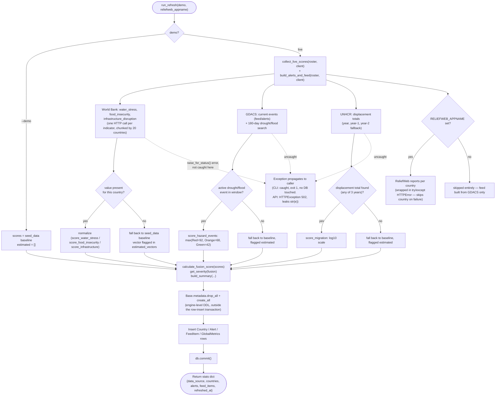
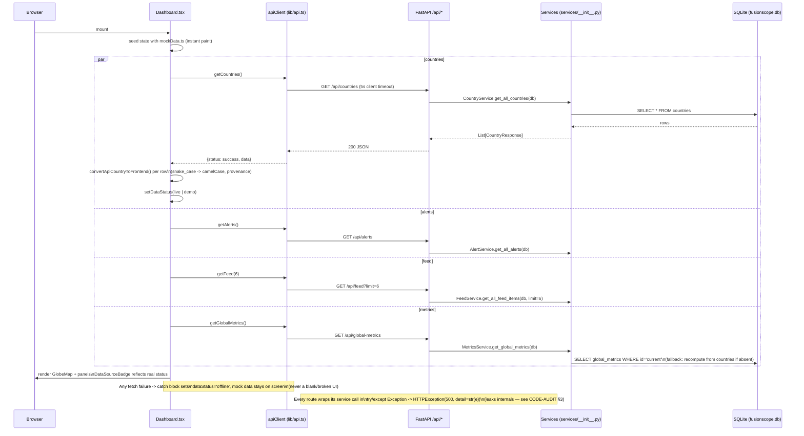

# FusionScope Architecture

A humanitarian-crisis "fusion" dashboard: six risk vectors per country, scored
from real keyless public APIs where possible, blended into one 0-100
instability score, and rendered on an interactive 3D globe with honest
live/demo provenance badges throughout. This document maps the codebase as it
exists on `real-data` (commit `2097e43`); see `docs/PROJECT-NOTES.md` for the
design-decision narrative and `docs/CODE-AUDIT.md` for a critical review.

## 1. Folder-by-folder map

```
backend/
  app/
    core/config.py       Settings (pydantic-settings) + manual env overrides
    db/database.py       SQLAlchemy engine/session, get_db() dependency
    models/country.py     Country, Alert, FeedItem, GlobalMetrics tables
    schemas/country.py    Pydantic response models (snake_case, API contract)
    etl/
      worldbank.py         World Bank indicator client (keyless)
      gdacs.py             GDACS disaster-event client (keyless)
      unhcr.py             UNHCR displacement client (keyless)
      reliefweb.py         ReliefWeb reports client (keyless but appname-gated)
      scoring.py           Fusion formula + normalization — single source of truth
      refresh.py           Orchestrator: fetch -> score -> rebuild DB -> alerts/feed
    services/__init__.py  CountryService / AlertService / FeedService / MetricsService
    api/routes.py          FastAPI routes (all under /api)
    main.py                App wiring: CORS, table creation, root/startup hooks
  scripts/seed.py          Thin CLI wrapper around refresh.run_refresh(demo=True)
  seed_data/countries.py   60-country curated baseline (demo dataset)
  tests/                   30 tests: scoring, ETL parsers (fixtures), API (see §5)
  Dockerfile               Seeds demo data at build time, serves via uvicorn
  render.yaml              Render deploy config (see backend hosting notes)

src/                       React 18 + TypeScript + Vite frontend
  lib/api.ts                FusionScopeAPI client — one method per endpoint, all `any`
  lib/convert.ts             convertApiCountryToFrontend(): snake_case -> camelCase
  hooks/use-data-provider.ts  Generic fetch-with-mock-fallback hook (UNUSED — see audit)
  data/types.ts               CountryData/Alert/FeedItem types + RISK_WEIGHTS mirror
  data/mockData.ts             Hand-authored demo dataset (independent of backend's)
  components/
    GlobeMap.tsx              three.js/@react-three/fiber rotating globe + markers
    DataSourceBadge.tsx        LIVE / DEMO DATA / OFFLINE · DEMO indicator
    TerminalCard.tsx, MetricCard.tsx, SeverityBadge.tsx  small presentational pieces
    ui/                        shadcn/ui primitives (untouched vendor components)
  pages/
    Index.tsx                  Marketing landing page (static, no data fetching)
    Dashboard.tsx               Main app: fetches countries/alerts/feed/metrics
    CountryDetail.tsx           Per-country deep dive (fetches by code)
    AlertsPage.tsx, FeedPage.tsx  Filterable lists — read mockData only (see audit)
    MethodologyPage.tsx         Static explanation of weights/bands/sources
  test/                        Vitest: fusion parity, converter, provenance badge

.github/workflows/
  ci.yml                      Backend pytest + frontend tsc/vitest/build, on push/PR
  refresh-data.yml            Cron (every 6h) POSTs /api/refresh to the deployed backend

docs/PROJECT-NOTES.md          Design rationale, known limitations, verification log
render.yaml, vercel.json       Deploy configs for backend (Render) / frontend (Vercel)
```

## 2. ETL refresh flow (per-source fallback)

`run_refresh(demo, reliefweb_appname)` in `backend/app/etl/refresh.py` is the
single entry point, invoked by the CLI (`python -m app.etl.refresh`), the
Docker build step (`--demo`), and `POST /api/refresh` (token-gated).



Key properties worth calling out:
- **Fallback granularity is per-vector, not per-source.** If World Bank answers
  for `water_stress` but not `food_insecurity` for a given country, only the
  missing vector falls back — the country still gets a mostly-live score.
- **Fallback does not cover source *outages***. The per-vector fallback only
  triggers when a source *responds* without a value for that country. If
  `worldbank.fetch_indicator` raises (network error, 5xx, timeout), the
  exception is not caught in `collect_live_scores` / `build_alerts_and_feed`
  (ReliefWeb is the only source wrapped in `try/except httpx.HTTPError`), so
  the whole refresh aborts before any DB write — see CODE-AUDIT §4.
- **Rebuild is drop-all/create-all, not a transactional swap.** The DDL
  (`Base.metadata.drop_all`/`create_all`, run against `engine`) is separate
  from the row-insert session that commits at the end — see CODE-AUDIT §2.

## 3. Request flow: dashboard load



`CountryDetail.tsx` follows the same per-country pattern
(`getCountry` → `convertApiCountryToFrontend`, then `getCountryAlerts` /
`getCountryFeed` with no conversion — see CODE-AUDIT §7). `AlertsPage.tsx` and
`FeedPage.tsx` do **not** participate in this flow at all; they render
`data/mockData.ts` directly regardless of backend state (CODE-AUDIT §1).

## 4. Refresh auth (`POST /api/refresh`)

```
X-Refresh-Token header --> hmac.compare_digest(header, settings.refresh_token)
```
- `settings.refresh_token == ""` (default/unset) → `503 Refresh endpoint not configured`.
- Token set but mismatched → `401 Invalid refresh token`.
- Token matches → runs `run_refresh(demo, reliefweb_appname)` synchronously in
  the request handler (no background task/queue — a live refresh blocks the
  worker for the duration of all upstream HTTP calls, bounded by the 90s
  client timeout per source, run sequentially: World Bank chunks, then GDACS,
  then UNHCR, then optionally ReliefWeb per country).
- Failure inside `run_refresh` → `502 Refresh failed: {e}` (leaks exception
  text — same pattern as the read routes).
- Called by `.github/workflows/refresh-data.yml` every 6 hours via `curl`
  against `secrets.BACKEND_URL` with `secrets.REFRESH_TOKEN`; silently
  no-ops (`exit 0`) if `BACKEND_URL` isn't set.

## 5. Scoring methodology (matches `backend/app/etl/scoring.py` exactly)

| Vector | Weight | Live source / indicator | Normalization | Fallback trigger |
|---|---|---|---|---|
| `water_stress` | 0.25 | World Bank `ER.H2O.FWST.ZS` (freshwater withdrawal, % of resources) | `clamp(value)` — values >100% (fossil-aquifer states) clamp to 100 | No value for country this run |
| `drought` | 0.20 | GDACS events, category `DR` (search window, alert level) | `max(Red=92, Orange=68, Green=42)` across active events | No active drought event in 180-day window |
| `flood` | 0.20 | GDACS events, category `FL`/`TC` | Same Red/Orange/Green mapping as drought | No active flood event in window |
| `food_insecurity` | 0.15 | World Bank `SN.ITK.DEFC.ZS` (undernourishment %) | `clamp(pct * 2.5)` — 0%→0, 40%+→100 | No value for country this run |
| `migration_pressure` | 0.10 | UNHCR displacement total (refugees + asylum seekers + IDPs, origin country), year / year-1 / year-2 | `clamp(20 * (log10(total) - 2))` — <100 people→0, 10M→100 | No rows for country across all 3 years tried |
| `infrastructure_disruption` | 0.10 | World Bank `EG.ELC.ACCS.ZS` (electricity access %) — structural proxy, not a live outage feed | `clamp(100 - pct)` | No value for country this run |

Demo mode: all six vectors come straight from `seed_data/countries.py`'s
hand-authored per-country baseline; `estimated_vectors` is always `[]`.

**Fusion score**: `round(Σ score[v] * weight[v])`, integer 0-100.

**Severity bands** (`get_severity`):

| Score range | Severity |
|---|---|
| 75-100 | critical |
| 55-74 | high |
| 35-54 | elevated |
| 0-34 | low |

The frontend mirrors both tables in `src/data/types.ts`
(`RISK_WEIGHTS`, `getSeverity`), independently tested on both sides
(`backend/tests/test_scoring.py`, `src/test/fusion.test.ts`) to catch drift
in CI rather than at runtime.

**GDACS event → vector mapping** (documented judgment call, `gdacs.py`):
`DR → drought`, `FL`/`TC → flood`, `EQ`/`VO`/`WF → infrastructure_disruption`.
Alert level → severity label: `red → critical`, `orange → high`,
`green → elevated`.

## 6. Config surface — every environment variable

### Backend (`backend/app/core/config.py`, read via `pydantic_settings.BaseSettings` + manual `os.getenv` overrides)

| Variable | Default | Effect |
|---|---|---|
| `DATABASE_URL` | `sqlite:///./fusionscope.db` | SQLAlchemy connection string. Also read directly (independently) by `backend/app/db/database.py` at import time — see CODE-AUDIT for the duplicated read path. |
| `DEBUG` | `False` | Parsed as `"true"` (case-insensitive) string compare; not otherwise wired into FastAPI (no debug-mode reload/tracebacks toggled from it in `main.py`). |
| `ALLOWED_ORIGINS` | `localhost:8080,3000` + 127.0.0.1 equivalents | Comma-separated list of CORS origins for `CORSMiddleware`. |
| `REFRESH_TOKEN` | `""` (disabled) | Shared secret required on `X-Refresh-Token` for `POST /api/refresh`. Empty = endpoint returns 503. |
| `RELIEFWEB_APPNAME` | `""` (disabled) | Approved ReliefWeb v2 appname; enables real report headlines in the feed. Empty = ReliefWeb step skipped entirely. |

### Frontend (`.env.local`, read via `import.meta.env`)

| Variable | Default | Effect |
|---|---|---|
| `VITE_API_BASE_URL` | `http://localhost:8000` | Base URL for every `FusionScopeAPI` call in `src/lib/api.ts`. Unset/unreachable → all fetches fail fast (5s client-side timeout) and the app falls back to bundled `mockData.ts`, labeled `OFFLINE · DEMO`. |

### Deploy / CI (not read by app code directly)

| Variable | Where | Purpose |
|---|---|---|
| `PYTHON_VERSION` | `render.yaml` | Pins Render's Python build image (3.13.1 — note: differs from the 3.12 pinned in CI/README; see CODE-AUDIT). |
| `BACKEND_URL` (secret) | `.github/workflows/refresh-data.yml` | Deployed backend base URL the cron job curls. |
| `REFRESH_TOKEN` (secret) | `.github/workflows/refresh-data.yml`, `render.yaml` (`generateValue: true`) | Must match the backend's `REFRESH_TOKEN` env var for the cron refresh to authenticate. |
| `ALLOWED_ORIGINS` | `render.yaml` (`sync: false`, manual) | Set to the deployed frontend origin post-deploy. |
| `RELIEFWEB_APPNAME` | `render.yaml` (`sync: false`, manual) | Optional, set once ReliefWeb approval is obtained. |

## 7. Test layout

### Backend — 30 tests, `pytest`, zero network (all against fixtures or `demo=True`)

- `backend/tests/test_scoring.py` — 16 tests (incl. 8 parametrized severity-band
  cases): weight sum, hand-computed fusion score, severity bands, clamp
  bounds, each normalization function, hazard max-level logic.
- `backend/tests/test_etl_parsers.py` — 7 tests: World Bank/GDACS/UNHCR parsers
  against `tests/fixtures/*.json` (World Bank/GDACS/UNHCR fixtures are
  *recorded* from the real APIs, trimmed; ReliefWeb fixture is synthetic
  since it requires an appname this repo doesn't ship), plus edge cases
  (empty rows, string/missing fields, hazard-grouping filter).
- `backend/tests/test_api.py` — 7 tests, module-scoped `TestClient` fixture
  seeded via `run_refresh(demo=True)` against a temp SQLite file: health
  provenance, country list/detail/404, alert source fields, feed limit,
  global-metrics/country consistency, refresh-endpoint auth (503/401/200).

Run: `cd backend && python -m pytest tests -q` (Python 3.12 — a 3.13 venv
fails to build the pinned `pydantic-core` from source per
`docs/PROJECT-NOTES.md`).

### Frontend — Vitest + Testing Library, `jsdom` environment

- `src/test/fusion.test.ts` — weight/severity parity with the backend
  formula, plus `convertApiCountryToFrontend` mapping and provenance-default
  behavior (no fabricated trend, demo default when unlabeled).
- `src/test/data-source-badge.test.tsx` — renders `DataSourceBadge` for all
  three statuses, asserts mutually-exclusive labels.

Run: `npm test` (`vitest run`). CI additionally runs `npx tsc -b` (typecheck)
and `npm run build` before/after tests (`.github/workflows/ci.yml`).

Notable gap: no tests cover `AlertsPage.tsx`/`FeedPage.tsx` (mock-only, not
wired to the API — CODE-AUDIT §1), `GlobeMap.tsx`, `Dashboard.tsx`'s fetch
orchestration, or `CountryDetail.tsx`'s alert/feed rendering path.
